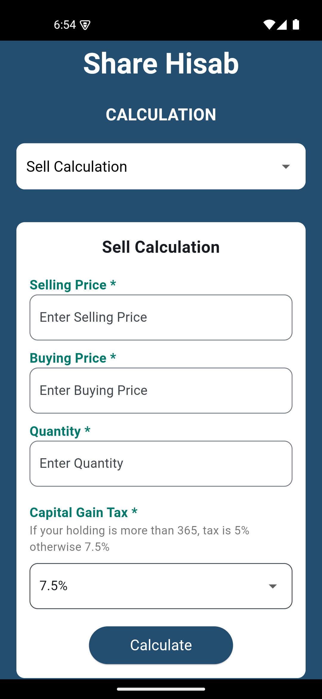

# ShareHisab

**ShareHisab** is a Flutter application designed to help users calculate the buy and sell prices of shares easily. With a user-friendly interface, the app allows users to input essential trading details and compute gains or losses, including capital gains tax calculations.


## Features
- **Buy Calculation**: Calculate total costs based on buying price and quantity.
- **Sell Calculation**: Calculate profit or loss based on selling price, buying price, and quantity.
- **Capital Gains Tax Calculation**: Automatically applies a 5% or 7.5% capital gains tax based on holding duration.
- **Error Handling**: Provides friendly error messages for invalid or missing input fields.
- **Intuitive User Interface**: Clean and simple UI for a great user experience.
User-friendly Interface**: A sleek and easy-to-navigate design.

## Screenshots


## Tech Stack
- **Framework**: [Flutter](https://flutter.dev/) - for creating cross-platform mobile apps.

## Getting Started
To run this project locally, follow these steps:

1. **Clone the repository:**
    ```bash
    git clone https://github.com/santoshvandari/ShareHisab.git
    cd ShareHisab
    ```

2. **Install dependencies:**
    ```bash
    flutter pub get
    ```

3. **Run the app:**
    ```bash
    flutter run
    ```

## Installation
To install the app on your Android device:
1. Download the latest APK from the [Releases](https://github.com/santoshvandari/ShareHisab/releases) section.
2. Transfer the APK to your phone and install it.

## Usage
1. Open the app.
2. Navigate to the Buy Calculation section to input the buying price and quantity.
3. Navigate to the Sell Calculation section to input the selling price, buying price, and quantity.
4. Select the appropriate capital gains tax percentage.
5. Click on the Calculate button to see your results.

## Contributing
We welcome contributions! Feel free to submit a pull request or open an issue if you find bugs or want to add new features.

## License
This project is licensed under the MIT License. See the [LICENSE](LICENSE) file for details.

## Contact
For any inquiries or support, please reach out at:
- **GitHub**: [@santoshvandari](https://github.com/santoshvandari)

---

Thank you for using ShareHisab! Stay informed and make smarter trading decisions effortlessly!